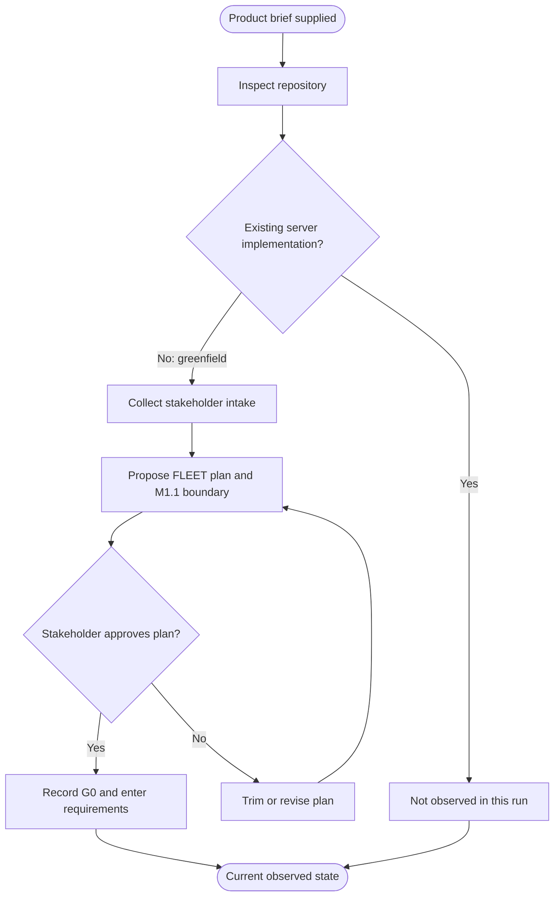
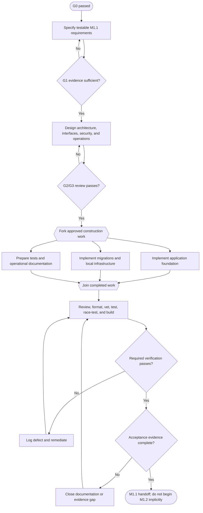
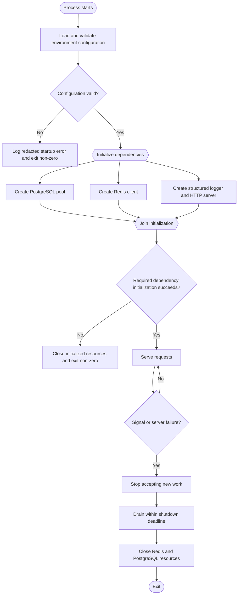

# LAYR Server M1.1 Process Model

Status: target model, except where explicitly labelled **observed current process**.  
Scope: M1.1 foundation only—configuration, PostgreSQL, Redis, migrations, HTTP serving,
structured logging, request IDs, liveness/readiness, graceful shutdown, reproducible Docker
development, tests, and documentation.

## 1. Observed current process

This describes what has actually happened. The repository began greenfield with a one-line
`README.md` and no implementation. The product brief and stakeholder intake were reviewed,
FLEET mode was selected, the plan was approved, and G0 was recorded. No M1.1 production code
or runtime process existed at the time of observation.

| Element | Definition |
| --- | --- |
| Trigger | User supplied the product brief and requested server work. |
| Roles | Stakeholder approves scope; conductor controls gates; specialist agents produce owned artifacts. |
| Inputs | Product brief, intake answers, repository evidence. |
| Decisions | Existing implementation? Plan approved? Both outgoing conditions are labelled above. |
| Outputs | Approved M1.1 FLEET plan, G0 evidence, process ledger, phase assignments. |
| Exceptions | Rejected plan loops through revision; any claimed pre-existing implementation must be reconciled against repository evidence. |
| Handoff | Stakeholder → conductor at approval; conductor → analyst after G0. |
| Evidence limit | This model does not claim requirements, design, code, or tests are complete. |

## 2. Target M1.1 development process

This is the process the fleet should follow; it is not a description of completed work. Work
may proceed concurrently only after inputs are approved, and the join requires every assigned
artifact and review result.

| Activity | Owner | Inputs | Output / handoff |
| --- | --- | --- | --- |
| Specify M1.1 | Analyst | Approved brief and intake | Requirements and traceability → architect/verifier |
| Design foundation | Architect, interaction designer | Approved requirements | Architecture and API/interface decisions → constructor |
| Construct application | Constructor | Approved design | Go source and unit tests → verifier |
| Build data/infrastructure layer | Constructor, configuration engineer | Schema and toolchain decisions | SQL migrations and Docker development environment → verifier |
| Prepare verification/operations | Verifier, documentarian | Requirements and design | Test plan, runbooks, setup guidance → quality auditor |
| Verify and review | Verifier, quality auditor | Joined implementation and documents | Command evidence and findings → conductor |
| Accept M1.1 | Conductor, stakeholder where required | Passed gates and acceptance evidence | Explicit M1.1 handoff; M1.2 remains out of scope |

### Development exception policy

| Condition | Required path |
| --- | --- |
| Requirement or design is ambiguous | Return to its owner; record the open item rather than guessing. |
| Requirement changes | Submit and assess a change request before implementation. |
| Review finds a security or secret-handling defect | Stop affected construction, remediate, and repeat review plus relevant tests. |
| PostgreSQL/Redis/Docker is unavailable | Run all independent checks; report infrastructure-dependent evidence as unverified, never passed. |
| A verification command fails | Record a defect, remediate, and rerun the failed command plus affected regression suite. |
| Proposed work belongs to M1.2+ | Reject from this increment or obtain an explicit scope change. |

## 3. Target M1.1 runtime process

The foundation has four bounded runtime paths: startup, request processing, readiness, and
shutdown. `/health` proves process liveness only. `/ready` evaluates required dependencies
without performing expensive work.

| Runtime element | Definition |
| --- | --- |
| Configuration | Environment-derived, validated before serving; secrets are never emitted. |
| Initialization fork/join | PostgreSQL, Redis, logging, and HTTP dependencies may initialize independently; serving begins only after the join and success decision. |
| Request boundary | Assign or validate a request ID, propagate `context.Context`, enforce limits/timeouts, log structured completion data, and return a stable non-secret error response. |
| `GET /health` | Returns liveness from in-process state; it does not query dependencies. |
| `GET /ready` | Checks required PostgreSQL and Redis connectivity under short bounded timeouts; any required failure yields not-ready. |
| Shutdown | Triggered by termination signal or fatal server error; stop admission, drain with a deadline, then close dependencies. |
| Failure handling | Startup failure exits non-zero after redacted logging and cleanup; request failure remains isolated to that request unless the server itself is unhealthy. |

## 4. Model maintenance

The process-modeler updates this document when a gate changes how work actually flows. Once
M1.1 runs, observed deviations must be added to the current model before changing the target
model. Repository evidence outranks this document when they disagree.
