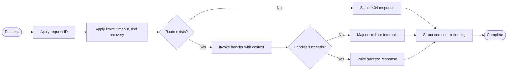

# LAYR Server M1.1 Workflow Definitions

These are target workflows for the approved M1.1 foundation. They do not claim that the server
has been implemented. M1.2 identity/OAuth and all import, Design IR, generation, and export work
are excluded.

## WF-01 — Controlled M1.1 change

| Field | Definition |
| --- | --- |
| Purpose | Move one approved M1.1 requirement into verified code or documentation. |
| Trigger | A requirement and its design input have passed the applicable review gate. |
| Roles | Conductor (scope/gates), artifact owner (implementation), reviewer, verifier, configuration engineer. |
| Inputs | Requirement ID, design element, acceptance criteria, repository state. |
| Activities | Confirm traceability → implement smallest coherent change → review → run affected tests → run quality commands → update docs/evidence. |
| Decisions | In scope? Review accepted? Tests and checks passed? Acceptance evidence complete? |
| Outputs | Reviewed change, test evidence, updated traceability/documentation. |
| Handoffs | Conductor → artifact owner → reviewer → verifier → conductor. |
| Exceptions | Out-of-scope work becomes a change request; failed review returns to owner; failed verification becomes a defect and loops through remediation. |
| Completion | Evidence supports the requirement and no relevant open defect remains. |

## WF-02 — Service startup

| Field | Definition |
| --- | --- |
| Purpose | Reach a serving state only with valid configuration and initialized required dependencies. |
| Trigger | Server process starts. |
| Roles | Process supervisor, configuration loader, application bootstrap. |
| Inputs | Environment variables, build, PostgreSQL and Redis endpoints. |
| Activities | Load config → validate all critical fields → construct logger → initialize PostgreSQL/Redis clients → construct HTTP server → begin serving. |
| Decisions | Config valid? Required dependency initialization successful? Listener opened? |
| Outputs | Serving process or explicit non-zero failure. |
| Handoffs | Supervisor → bootstrap; bootstrap → HTTP server; failure → supervisor/operator through exit status and redacted logs. |
| Exceptions | Invalid config: fail fast. Partial initialization: close acquired resources. Bind failure: close dependencies and exit non-zero. |
| Completion | Listener is active and the service can evaluate readiness. |

## WF-03 — HTTP request lifecycle

| Field | Definition |
| --- | --- |
| Purpose | Process requests consistently with correlation, bounded resources, and safe errors. |
| Trigger | HTTP request accepted while the server is serving. |
| Roles | HTTP middleware chain, route handler, structured logger. |
| Inputs | Request, trusted server configuration, request-scoped context. |
| Outputs | HTTP response and structured completion event containing request ID, method, path/route, status, and duration. |
| Decisions | Route exists? Handler succeeds? Context cancelled or deadline exceeded? |
| Handoffs | Listener → middleware → handler → middleware/logger → client. |
| Exceptions | Panic is recovered and mapped to a generic 500; timeout/cancellation stops downstream work; secrets and sensitive headers are excluded from logs. |
| Completion | Response is finalized and request-scoped work is released. |

## WF-04 — Health and readiness probes

| Field | Definition |
| --- | --- |
| Purpose | Distinguish a live process from one ready to accept dependent work. |
| Trigger | `GET /health` or `GET /ready`. |
| Roles | Probe client, health handler, dependency checkers. |
| Inputs | In-process state; for readiness only, PostgreSQL and Redis clients. |
| Activities | Health: return liveness. Readiness: create short timeout → check required dependencies (concurrently if safe) → join results → respond. |
| Decisions | Probe type? Did every required readiness check succeed before its deadline? |
| Outputs | Lightweight machine-readable status with appropriate HTTP status; no credentials or connection details. |
| Handoffs | Probe client → HTTP handler → dependency clients → handler → probe client. |
| Exceptions | Timeout or any required dependency failure produces not-ready; health remains independent unless the process cannot serve HTTP. |
| Completion | Probe receives a bounded response. |

## WF-05 — Database migration

| Field | Definition |
| --- | --- |
| Purpose | Apply explicit, ordered SQL schema changes reproducibly. |
| Trigger | Developer/operator invokes the documented migration command before a build requiring that schema serves traffic. |
| Roles | Developer/operator, migration tool, PostgreSQL. |
| Inputs | Database URL supplied securely, ordered migration files, target build compatibility. |
| Activities | Validate target → acquire migration coordination/lock → read current version → apply pending migrations in order → record version → release lock. |
| Decisions | Target correct? Pending migrations? Migration succeeds? |
| Outputs | Known schema version and migration execution result. |
| Handoffs | Developer/operator → migration tool → PostgreSQL → operator/startup workflow. |
| Exceptions | Lock unavailable: abort safely. SQL failure: stop at failure and report exact migration without leaking secrets. Unknown/divergent version: refuse automatic continuation. |
| Completion | All required migrations are applied exactly once, or execution has stopped with actionable failure evidence. |

## WF-06 — Graceful shutdown

| Field | Definition |
| --- | --- |
| Purpose | Stop the process without accepting new work or abandoning bounded in-flight work. |
| Trigger | SIGTERM/SIGINT or fatal HTTP server error. |
| Roles | Process supervisor, signal handler, HTTP server, PostgreSQL/Redis clients. |
| Inputs | Shutdown signal/error and configured shutdown deadline. |
| Activities | Mark not-ready → stop accepting requests → cancel root context → drain HTTP work → close dependency clients → return exit status. |
| Decisions | Did drain finish before deadline? Was trigger a normal signal or fatal error? |
| Outputs | Closed resources, structured shutdown events, truthful exit status. |
| Handoffs | Supervisor/signal source → bootstrap → HTTP server → dependency clients → supervisor. |
| Exceptions | Deadline exceeded: force server close, record timeout, then close dependencies. Close errors are logged and influence exit status where appropriate. |
| Completion | No listeners remain and owned resources have been closed or reported failed. |

## WF-07 — Local verification and handoff

| Field | Definition |
| --- | --- |
| Purpose | Establish reproducible evidence that M1.1 is fit for handoff. |
| Trigger | Joined implementation is ready for verification. |
| Roles | Verifier, quality auditor, configuration engineer, conductor. |
| Inputs | Source, tests, migrations, Docker configuration, documentation. |
| Activities | Format check → vet → unit/integration tests → race test → build → Docker configuration validation → diff whitespace check when Git exists → inspect documentation/traceability. |
| Decisions | Tool available? Infrastructure available? Command passed? Acceptance coverage complete? |
| Outputs | Command-by-command results, defect records, M1.1 acceptance recommendation. |
| Handoffs | Constructor/configuration engineer → verifier → quality auditor → conductor. |
| Exceptions | Unavailable dependency is marked unverified and separated from failures. Any failure blocks acceptance, is recorded, remediated, and rerun with affected regressions. |
| Completion | All required available checks pass, infrastructure-dependent gaps are explicitly resolved or accepted through a recorded gate decision, and no critical/open blocking defect remains. |

## Workflow-wide controls

- PostgreSQL is the durable source of truth; Redis use must be justified and non-durable.
- Logs are structured and redact credentials, URLs containing secrets, cookie/session values,
  and future OAuth/BYOK material.
- Every wait, probe, request, and shutdown drain is bounded by context or timeout.
- M1.1 does not create users, sessions, OAuth flows, projects, imports, assets, Design IR,
  generation, GitHub export, or permanent object storage.
- A new workflow or scope expansion requires requirements and gate evidence before code.
